# Creating new Card Templates (Optional)

A collection of card templates are included in this repo. The various color borders have been created by using noise filters. The parchment background has been created by following [this tutorial](https://hmturnbull.com/fantasy-writing/maps/parchment-gimp/).

If you want to create your own templates, it is possible. I have included the .xcf file which I've used which can be re-used by anyone, though it does involve some basic image manipulation in [Gimp](https://www.gimp.org/).

I have included step-by-step instructions for two different ways

## Creating a new Template from an image

You will need to have the image ready that you want to use as the template's background. Whether that image is one you have created yourself or found somewhere is up to you. It should be 745x1040 px, or have a similar ratio which can be resized, or be a image that can be cut without losing the visuals you want in the template.

Once you have your image ready, follow the steps below to create a template from it.

1. Open the `Card_Template_From_Image.xcf` file in Gimp
2. Right-click the "Border - Green" layer and select "New layer"

    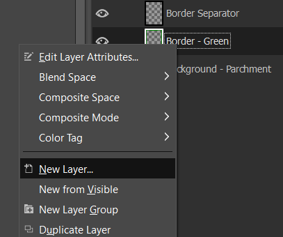

3. Name the new layer whatever you wish ("Border - color_name" is my preferred way). This will create an empty layer in the correct placement.
4. Make sure only the following 4 layers are visible: "Background - Parchment", the newly created layer ("Border - Orange" in this example), "Border Separator", and "Border Separator Gradient". You should only see a the parchment with a lines and a bit of shading.

    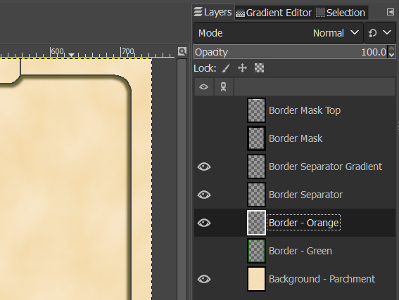

5. Paste or drag/drop your image onto the new layer, then resize it using the Scale Tool. You can click anywhere in the image to bring up a prompt where you can type the dimensions you want. You might have to merge the image down onto the "Border - Orange" layer, if the image you imported created a new layer.

    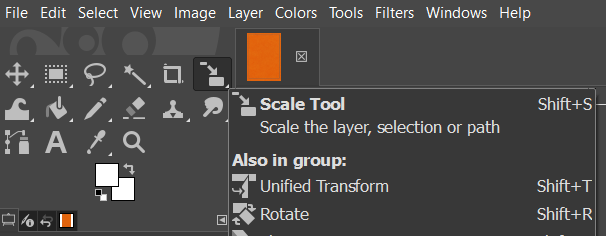
    
    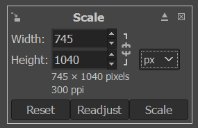

6. Next, select the "Border Mask" layer (_do not unhide it_) and select the Fuzzy Select Tool

    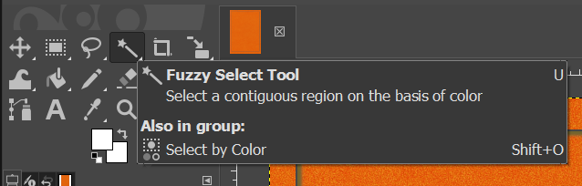.

7. Click in the middle of the image where the parchment will be in the end.
8. Select the "Border - Orange" layer again and press the delete key on your keyboard to reveal the parchment background.

    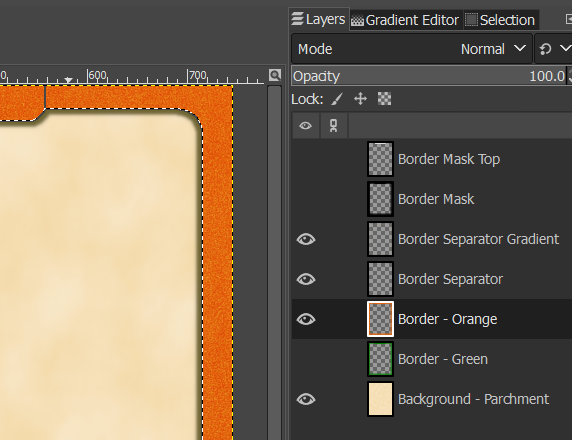

9. Select the Color Picker Tool and click a color you want at the top of the template. Usually a lighter color is better.

    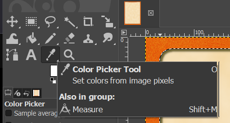

10. Select the "Border Mask Top" layer (_do not unhide it_), select the Fuzzy Select Tool, and click the top section of the of the template.

    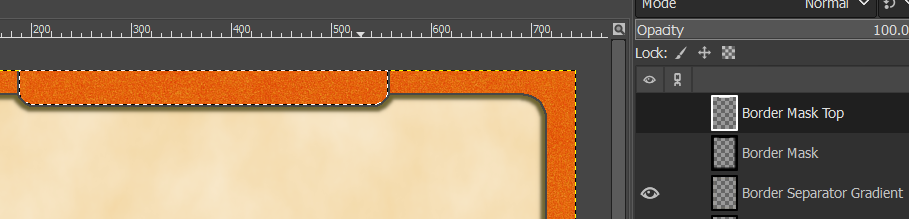

11. Select the "Border - Orange" layer, then select the Bucket Fill Tool. Set the Opacity to 100 and the Threshold to something high (150 is usually enough).

    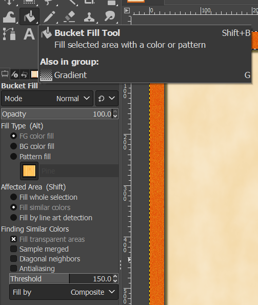

12. With the bucket tool, click the the area you selected in step #10 to turn it into a solid color.

    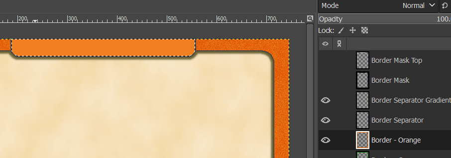

13. Go to `File -> Export As`, name the file `Card_Template_NAME.png` (replacing `NAME` with what you want to call the template) and Export it to the same folder as the other templates. NOTE: No spaces in the file name, use underscores `_` instead. For this example, I'd name the file `Card_Template_Orange_Grain.png`

14. Go to the Google Sheet with your card data, click the Validations tab, and type the name (what you wrote instead of `NAME` in step 13) in an empty spot under "Card Templates". You can now select the template in the sheet, and Nandeck should be able to locate and use the file automatically.

## Creating a new Template using existing Patterns

This method is mostly if you want more color variations to choose from for your cards or if you want different patterns.

1. Open the `Card_Template_ From_Pattern.xcf` file in GIMP

2. Open the Gradients window and verify that the "FG to BG (RGB)" option is selected.

    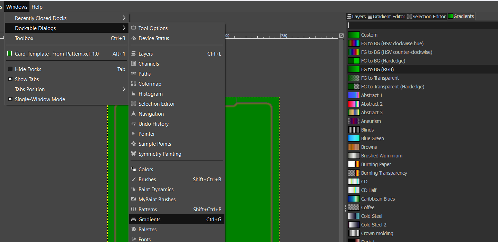

3. Choose the base color you want for the template and fill in the "Background Color" sheet with it. I recommend choosing a color that isn't too bright or too dark for this step, as a darker and lighter variation of the same color will be used in a later step. Furthermore, when choosing colors, I recommend using the Color Wheel with the color options set to HSV (marked with blue and green respectively in the picture below), as it makes it easier to choose color variations later on.

    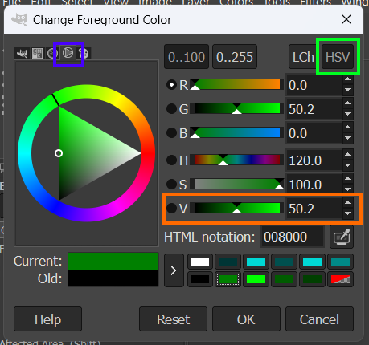

4. Unhide each of the patterns and decide which one you want to use, then Right-click it and select "Duplicate Layer". We duplicate it because we'll be making destructive changes to it meaning it can't be restored to normal. You can Undo your changes, but I find it easier to just duplicate the layer. I also like to move the new layer to just above the "Background Color" layer outside the "Patterns" Layer Group, but it isn't necessary

    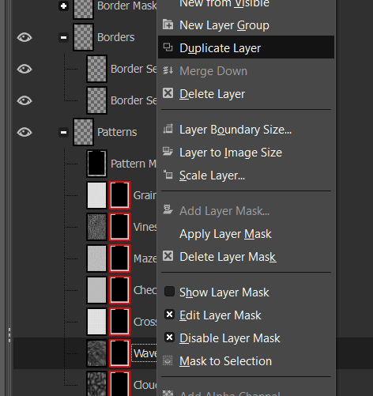

    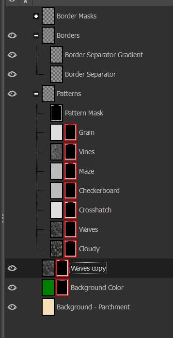

5. Right-Click the "Background Color" layer and turn off "Disable Layer Mask". Do the same for the duplicated pattern layer. You will end up with a card that has your base color at the top and the greyscale pattern as the border.

    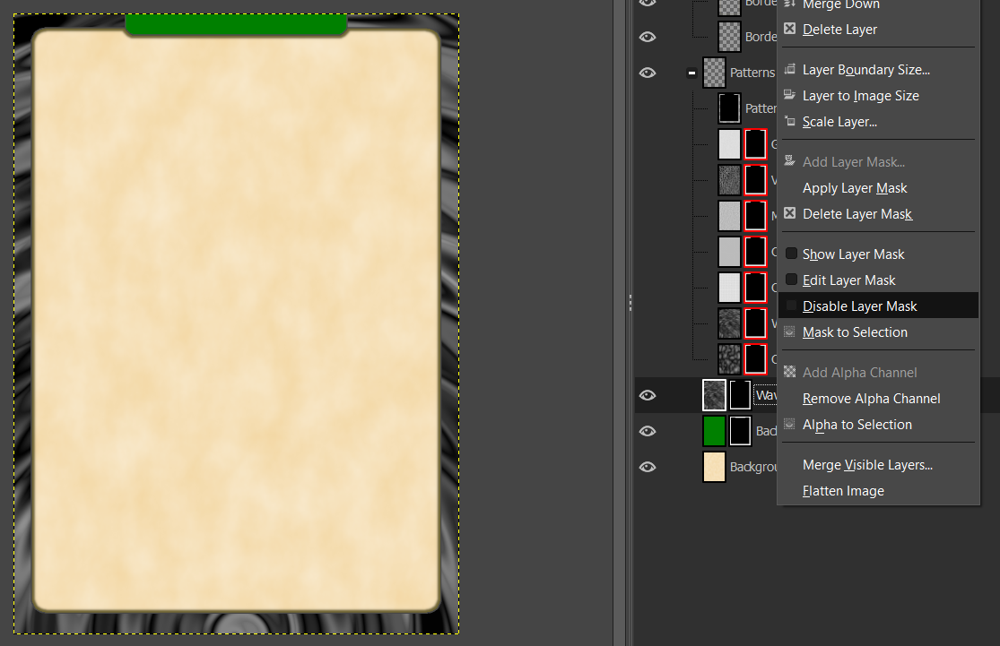

6. Make sure you have the duplicated pattern layer selected and specifically that you have the _image_ not the _layer mask_ selected. There should be a white boarder around the image. If in doubt, Right-Click the layer and verify that "Edit Layer Mask" is _not_ ticked.

    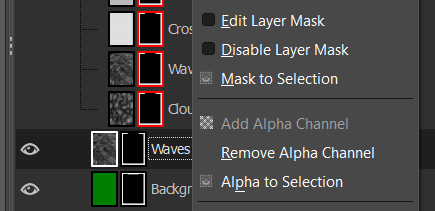

7. Now you need to select a darker and a lighter variation of your main color as your Foreground and Background colors. An easy way to do this is by opening the color picker, selecting your base color, then sliding the "V" bar (marked in orange in the color wheel picture above) either left (darker) or right (lighter). I find that subtracting or adding around 20-30 either way often works well, but experiment to figure out what you like.

    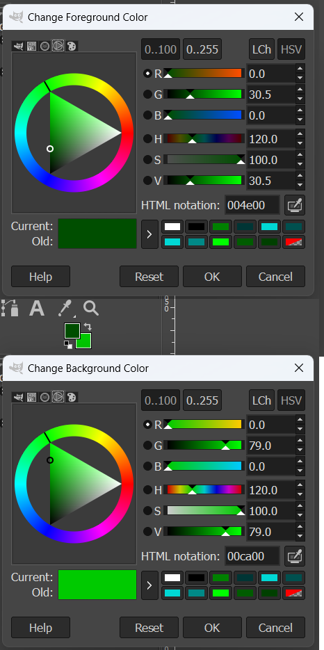

8. At the top select `Colors -> Map -> Gradient Map`. Your Foreground and Background colors will be applied to the pattern layer, with Foreground replacing the dark parts of the grayscale pattern and Background replacing lighter parts. This is the destructive change. I do it this late in the process in order to make it easier Undo it if the result isn't what I want.

    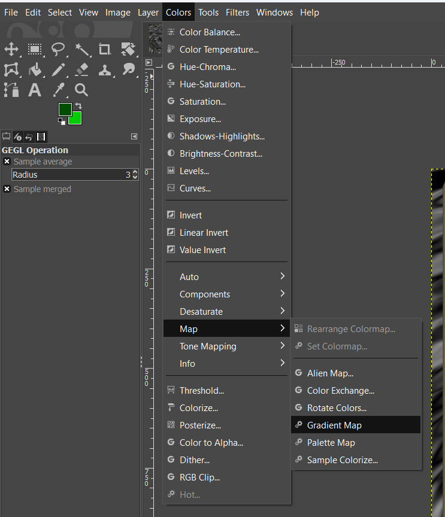

    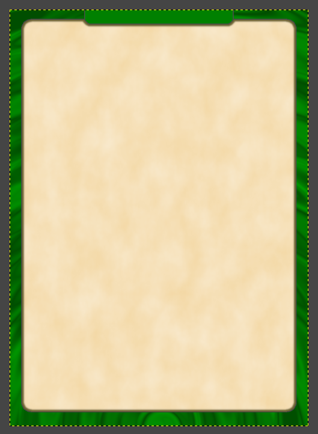

9. If you are happy with the colors, follow the next two steps to export the image and get it working with the Google Sheets. If not, Undo the Gradient Map (ctrl+Z or equivalent) and then repeat steps 7 and 8 until you find something you like.

10. Go to `File -> Export As`, name the file `Card_Template_NAME.png` (replacing `NAME` with what you want to call the template) and Export it to the same folder as the other templates. NOTE: No spaces in the file name, use underscores `_` instead. For this example, I'd name the file `Card_Template_Green_Waves.png`

11. Go to the Google Sheet with your card data, click the Validations tab, and type the name (what you wrote instead of `NAME` in step 10) in an empty spot under "Card Templates". You can now select the template in the sheet, and Nandeck should be able to locate and use the file automatically.

If you wish, you can modify the pattern however to come up with new ideas. Using the "Filters" menu and one of its many options is an easy way to mess around with things. Just remember to duplicate a layer before you start modifying it, as you can't easily reverse the Filter changes.