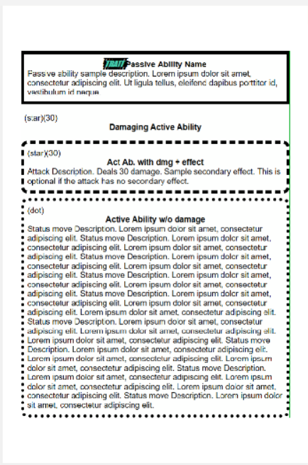
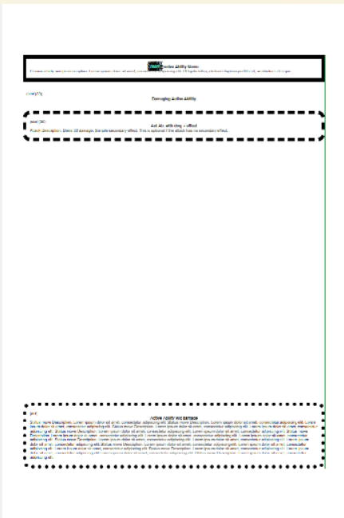
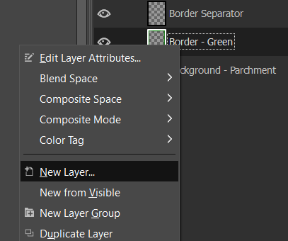
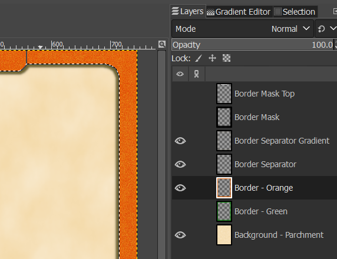
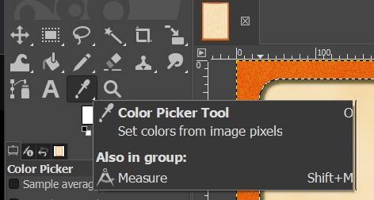

# pf2e-cardforge

**pf2e-cardforge** is a set of scripts and templates for generating PF2e reference cards using Nandeck and Google Sheets. The reference cards are designed to streamline prep and gameplay with layouts that are quick to parse and can be created for spells, feats, items, and more.

## Installation/Setup

1. **Clone/download this Repo**

2. **Download the Fonts**  
   Two special fonts are used for the cards. Both fonts match the official Pathfinder fonts fairly well, which is why they've been selected. However, these are not installed on most machines by default, so you will need to download them and install them on your computer. 
   
   Below are links to where I have found the fonts myself. If one of them don't work/no longer exists/whatever, you might have to find the font somewhere else. Alternatively, you can use different fonts by editing the scripts (more on this later).
   - [CrimsonPro-Variable.ttf](https://www.fontshare.com/fonts/crimson-pro). Click "Download Family", then open the .zip file and go into `CrimsonPro_Complete -> Fonts -> TTF` to find the file.
   - [Taroca Regular.ttf](https://freefonts.co/fonts/taroca-regular). Click "Download font", then open the .zip file and go into `Taroca Regular` to find the file.

   Once you have the .ttf file, double-click it to open it, then click the "Install" button. I also save them into the "Font" folder just in case I need them again later, but that is not a necessary step.

3. **Download Nandeck**  
   Download from [https://www.nandeck.com](https://www.nandeck.com). NOTE: As of writing this, the lates version `1.28.2` contains a bug that means text doesn't scale properly, causing cards to have a lot of empty space. It is confirmed that version `1.28.3.beta2` contains a fix for this issue, but you will need to go to the Discord to find a link to that version.

   In order to verify that you have a version that fixes the issue, launch Nandeck and click "Open deck", then open the `Test_DynamicBoxLayout.txt` file. Click "Validate deck" and then "Build deck". If the result is similar to the left image below, all is good. If it is similar to the right image, you need to find a different version.

    

4. **Copy the Google Sheets Template**  
   Create a copy of the [Nandeck PF2e Card Data](https://docs.google.com/spreadsheets/d/1eklVjtuwi2jCBNKpKFjLM-377riymgW4eLRoURrabAw/copy) Google Sheet. This sheet designed to work with the scripts and allow for easy entry of data for new cards.
   1. In the new copy, Click the "Share" button and set it so "Anyone with the link" has "Viewer" access. This allows Nandeck to access the sheet. Then click the "Copy link" button
   2. Paste the link somewhere (Notepad or similar) and remove `https://docs.google.com/spreadsheets/d/` and everything after the final `/`. It should leave you with a long string similar to `1eklVjtuwi2jCBNKpKFjLM-377riymgW4eLRoURrabAw` which is the ID of the Google Sheet. This particular string is from the main sheet.
   3. Open the `PF2e Generate Cards For Sheet.txt` and replace `GOOGLE_SHEETS_ID_GOES_HERE` with the ID you just found. Save the file.

Everything should now be ready for you to start creating cards.

## Usage Instructions

Creating a new card and readying it for print is a 3-step process: You need to add the card data to the google sheet, then create the card images using the provided scripts, and finally create a PDF from the card images. Each step is explained below.

### Add Card Data to Google Sheet

The Google Sheet you have created a copy of comes with a lot of examples already, which should help you figure out what to do. You can do whatever you want with the examples, but if you want ot keep them for reference without creating cards for them, simply make sure the "Enable" column isn't ticked. There is also a README sheet, which explains the basics of the sheet.

That said, here are some instructions on how to fill in a new card:

1. Figure out what you want to create a card for and figure out which sheet the feature/spell/item belongs to:
    - "Skill_vs_Defense" is for any action/feature where a character rolls a check against a target's defense (fx. _Trip_, _Demoralize_, etc.). This doesn't include spells.
    - "Spells" is for spells.
    - "Simple_Action" is for any action/feature that does not specifically include a check against a defense. This is most class features or feats.
    - "Item_Consumables" is for consumable items.
    - "Custom_Cards" is for other custom ideas.

2. Go to the sheet and start filling in the information you want on the card. Dark green columns are mandatory while light green columns are optional. For example for _Demoralize_, the "Requirement" column will not be filled in, as _Demoralize_ has no requirements.

    The sheets are set up to allow for easy data inputting, and will handle the formatting that is common across all cards of the same type. For example, filling data into a row in "Simple_Action" will handle formatting the degrees of success correctly.

You can add more custom formatting in the different columns such as making text **bold**, _italic_, etc. The instructions are included in the README sheet.

### Create Card Images

1. Launch Nandeck, click "Open deck", and then select the `PF2e Generate Cards For Sheet.txt` file. Nandeck will remember which "decks" you have opened, so this step will not be necessary in the future.
2. Verify that the `LINK = JOIN(` command references your copy of the "Nandeck PF2e Card Data" Google Sheets, which you created in step 4 of Installation.
3. Set `[card_category]` to the sheet you want to create cards from.
4. Click the "Validate deck". If the terminal below does not say "Deck valid", you will have to figure out what the error is and fix it. Otherwise all is good and you can click "Build deck".
5. The script will now start creating all the cards that have been flagged as "Enable" in the Google Sheet. They will be saved in the `Cards/` directory. It might look like Nandeck is attempting to create around 200 cards, that is because even empty rows are considered a card due to the formatting forumlas that have been used in the sheets. Just ignore that. Nandeck will make only create the Enabled cards.
    
   Note that each card may take a while to create, as there's a lot of calculations of text size going on in the background. On my machine, it is around 6 seconds per card.

Using the script as is, only images for the front side of the cards will be created. There are commands at the bottom of the script that cna be enabled to also create the backs of the cards, which you can enable if you want.

### Create PDFs

1. In Nandeck, open the `PF2e Create PDF.txt` file.
2. Set `[card_category]` to folder you want to pull the images from (the same name as the sheet in Google Sheets).
3. Set `[file_name_suffix]` to whatever you want. This value is added to the end of the PDF name. It can be changed between runs to avoid overwriting existing PDF files.
4. Determine if you want the PDF to be created as duplex (printing on front and back of the paper) or not. This is only relevant if you have created both fronts and backs of cards. If yes, enable line 83-85 and outcomment line 88. If no, leave it as is.
5. Click the "Validate deck". If the terminal below does not say "Deck valid", you will have to figure out what the error is and fix it. Otherwise all is good and you can click "Build deck".

By default, the script will take all images in the given `[card_category]` folder and create a single PDF with all of them. If you only want certain cards (or want cards from multiple different folders), see the examples on line 26 to 50 of the script on how to accomplish that.

## Creating new Card Templates (Optional)

A collection of card templates are included in this repo. The various color borders have been created by using noise filters. The parchment background has been created by following [this tutorial](https://hmturnbull.com/fantasy-writing/maps/parchment-gimp/).

If you want to create your own templates, it is possible. I have included the .xcf file which I've used which can be re-used by anyone, though it does involve some basic image manipulation in [Gimp](https://www.gimp.org/).

You will need to have the image ready that you want to use as the template's background. Whether that image is one you have created yourself or found somewhere is up to you. It should be 745x1040 px, or have a similar ratio which can be resized, or be a image that can be cut without losing the visuals you want in the template.

Once you have your image ready, follow the steps below to create a template from it.

### Creating a new Template

1. Open the .xcf file in Gimp
2. Right-click the "Border - Green" layer and select "New layer"

    

3. Name the new layer whatever you wish ("Border - color_name" is my preferred way). This will create an empty layer in the correct placement.
4. Make sure only the following 4 layers are visible: "Background - Parchment", the newly created layer ("Border - Orange" in this example), "Border Separator", and "Border Separator Gradient". You should only see a the parchment with a lines and a bit of shading.

    

5. Paste or drag/drop your image onto the new layer, then resize it using the Scale Tool. You can click anywhere in the image to bring up a prompt where you can type the dimensions you want. You might have to merge the image down onto the "Border - Orange" layer, if the image you imported created a new layer.

    
    
    

6. Next, select the "Border Mask" layer (_do not unhide it_) and select the Fuzzy Select Tool

    .

7. Click in the middle of the image where the parchment will be in the end.
8. Select the "Border - Orange" layer again and press the delete key on your keyboard to reveal the parchment background.

    

9. Select the Color Picker Tool and click a color you want at the top of the template. Usually a lighter color is better.

    

10. Select the "Border Mask Top" layer (_do not unhide it_), select the Fuzzy Select Tool, and click the top section of the of the template.

    

11. Select the "Border - Orange" layer, then select the Bucket Fill Tool. Set the Opacity to 100 and the Threshold to something high (150 is usually enough).

    

12. With the bucket tool, click the the area you selected in step #10 to turn it into a solid color.

    

13. Go to `File -> Export As`, name the file `Card_Template_NAME.png` (replacing `NAME` with what you want to call the template) and Export it to the same folder as the other templates.

14. Go to the Google Sheet with your card data, click the Validations tab, and type the name (what you wrote instead of `NAME` in step 13) in an empty spot under "Card Templates". You can now select the template in the sheet, and Nandeck should be able to locate and use the file automatically.

## Contributing

Pull requests are welcome! If you have improvements for layout, automation, or new types of cards, feel free to fork the project and submit a PR.

Please make sure any contributions respect the open-source license and avoid including copyrighted Pathfinder content.

## License

This project is licensed under the [MIT License](LICENSE).

You are free to use, modify, and redistribute this code as you like, with attribution.
